# Evidencias

Ejecuciones documentadas principalmente para `DT=2026-02-04` y validaciones adicionales el `2026-02-05`.

## 1) NameNode UI (9870)
- DataNodes vivos y capacidad total/uso visible en UI.
- Captura:
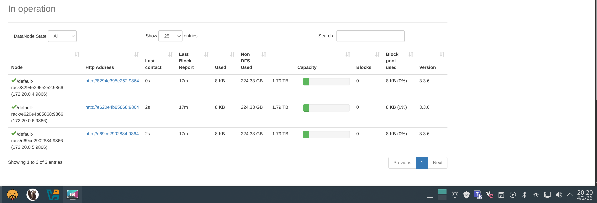

## 2) Auditoria fsck
- Salida de `hdfs fsck /data -files -blocks -locations` (bloques y locations).
- Captura:
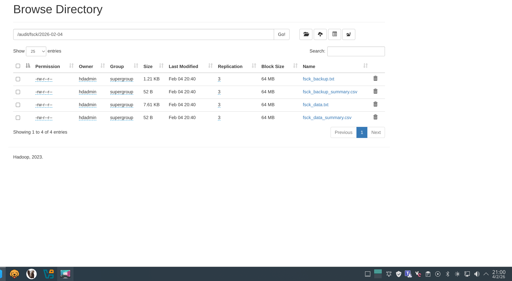
- Resumen de conteos (`CORRUPT`, `MISSING`, `UNDER_REPLICATED`) en CSV.
- Captura:
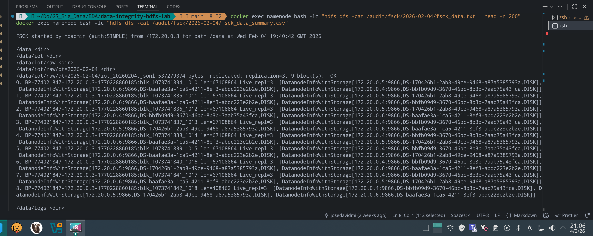
- Evidencia en UI de ficheros de auditoria guardados en `/audit/fsck/2026-02-04/`.
- Captura:
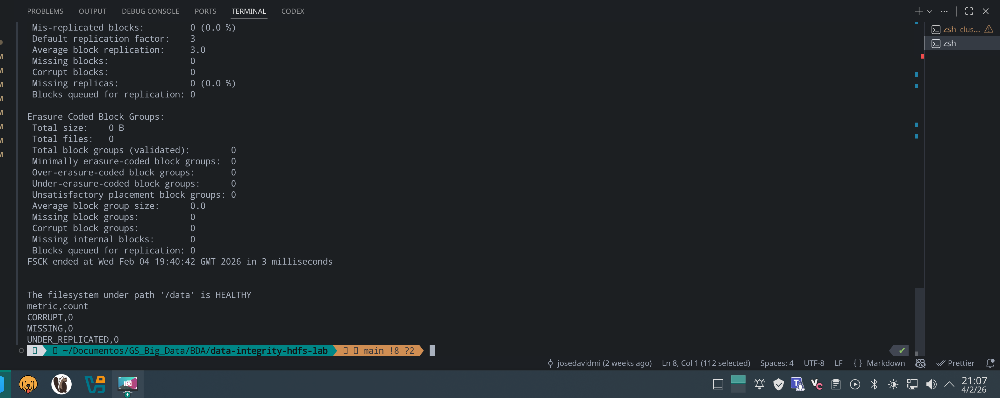

Resultado observado: `CORRUPT=0`, `MISSING=0`, `UNDER_REPLICATED=0`.

## 3) Backup + validacion
- Evidencia de copia a `/backup/.../dt=2026-02-04` y listados de rutas/tamanos.
- Capturas:
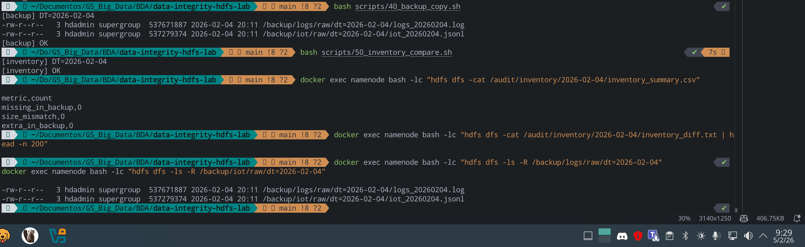
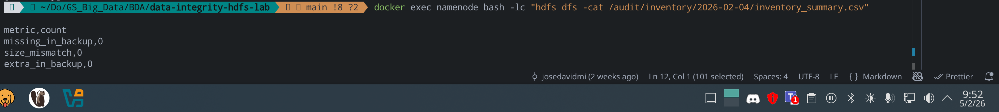
- Resumen de inventario origen vs destino (`inventory_summary.csv`).
- Capturas:
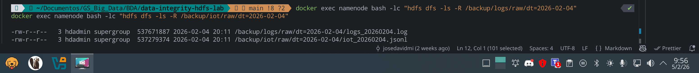

Resultado observado:
- `missing_in_backup=0`
- `size_mismatch=0`
- `extra_in_backup=0`

## 4) Incidente + recuperacion
- Simulacion de incidente controlado (parada/arranque de DataNode) y verificacion de estado.
- Capturas:
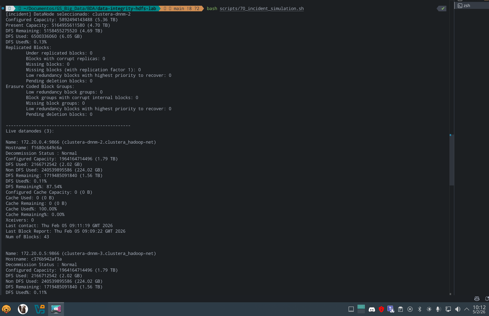
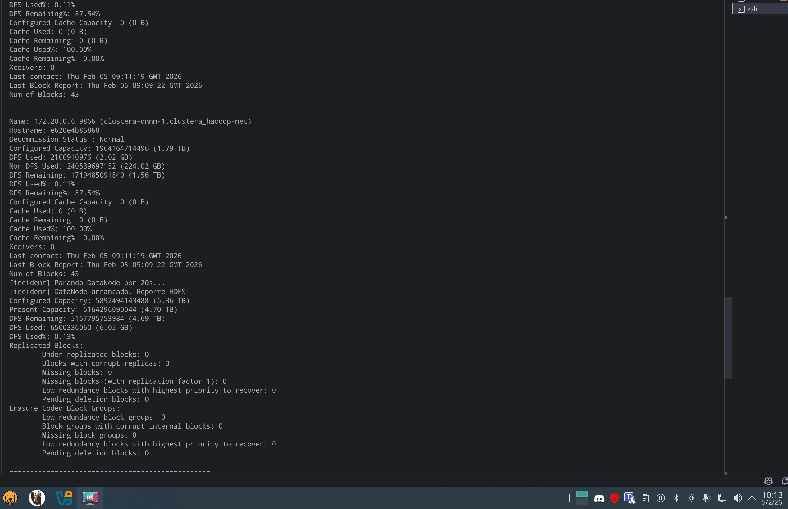
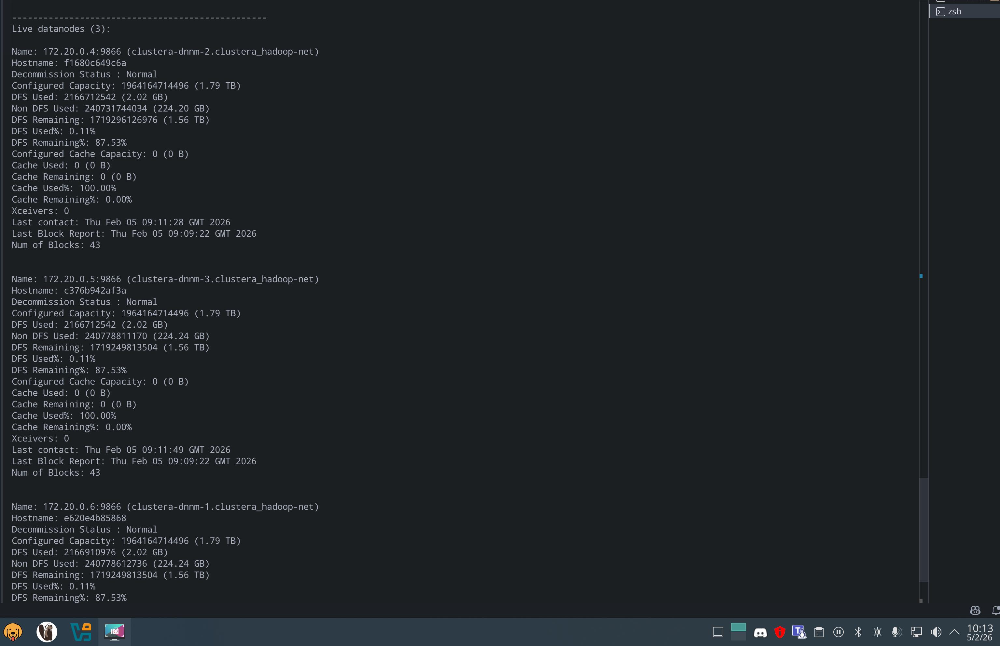
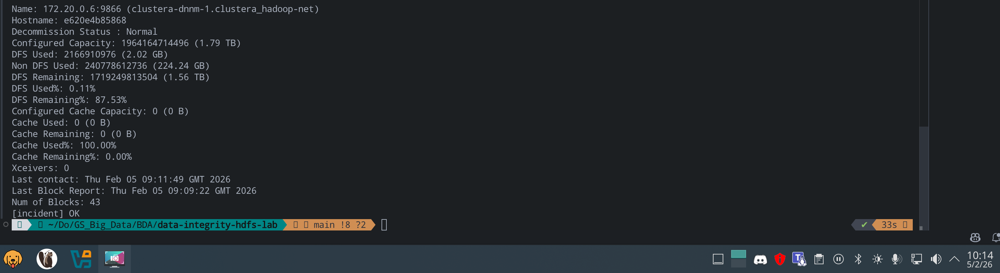
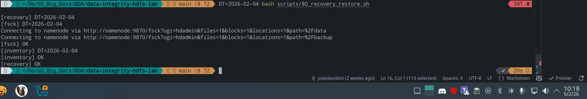
- Recuperacion y validacion final con script de restore.
- Captura:

## 5) Metricas
- Evidencia de consumo de recursos durante ejecucion (`docker stats`).
- Captura:

Tabla de tiempos/recursos (resumen del notebook `notebooks/03_entrega_integridad_metricas.ipynb`):

| Fase | Duracion (s) | CPU promedio (%) | Memoria promedio (MB) | Nota |
|---|---:|---:|---:|---|
| ingesta_hdfs | 18 | 0.78 | 705.0 | carga inicial en /data |
| fsck_auditoria | 6 | 0.26 | 700.0 | fsck data+backup y resumen |
| backup_copy | 14 | 0.91 | 736.0 | copia /data -> /backup |
| incident_simulation | 33 | 0.42 | 744.0 | parada/arranque de DataNode |
| recovery_restore | 20 | 0.58 | 766.0 | restauracion y verificacion final |
